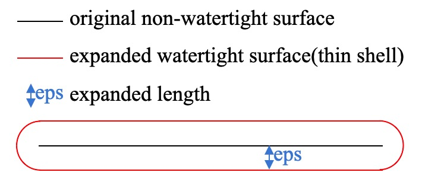
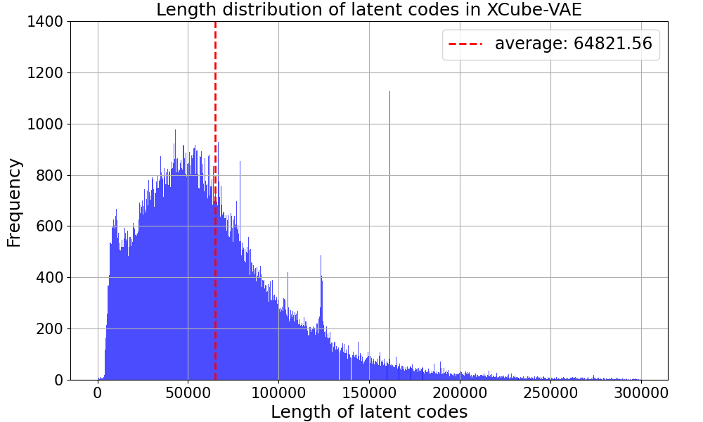
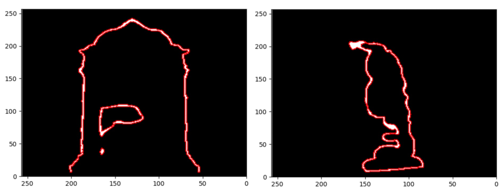

 # <p align="center"> <font color=#008000>Dora</font>: Sampling and Benchmarking for 3D Shape Variational Auto-Encoders </p>

 <!-- #####  <p align="center"> [Rui Chen](https://aruichen.github.io/), [Jianfeng Zhang*](http://jeff95.me/), [Yixun Liang](https://yixunliang.github.io/), [Guan Luo](https://logan0601.github.io/), [Weiyu Li](https://weiyuli.xyz/), Jiarui Liu</p> -->
<p align="center">
  <a href="https://aruichen.github.io/">Rui Chen</a><sup>1,2</sup>, 
  <a href="http://jeff95.me/">Jianfeng Zhang</a><sup>2*</sup>, 
  <a href="https://yixunliang.github.io/">Yixun Liang</a><sup>1</sup>, 
  <a href="https://logan0601.github.io/">Guan Luo</a><sup>2,3</sup>, 
  <a href="https://weiyuli.xyz/">Weiyu Li</a><sup>1</sup>, 
  <br>
  Jiarui Liu<sup>1</sup>,
  <a href="https://lixiulive.com/">Xiu Li</a><sup>2</sup>,
  <a href="https://www.xxlong.site/">Xiaoxiao Long</a><sup>1</sup>,
  <a href="https://scholar.google.com.sg/citations?user=Q8iay0gAAAAJ&hl=en">Jiashi Feng</a><sup>2</sup>,
  <a href="https://ece.hkust.edu.hk/pingtan">Ping Tan</a><sup>1*</sup>,
  <br>
  *Corresponding authors
  <br>
    <sup>1 </sup>HKUST
  <sup>2 </sup>Bytedance Seed
  <sup>3 </sup>THU
</p>
 
<p align="center">
  <br>
    <a href="https://arxiv.org/pdf/2412.17808">
      
    </a>
    <a href='https://aruichen.github.io/Dora/'>
      </a>
    <a href="https://youtu.be/6evNqk0b-bQ"></a>
</p>

<p align="center"> We are working on releasing the code 🏗️ 🚧 🔨</p>

## ToDo

- [x] Release sharp edge sampling (2025.2.11)
- [x] Release Dora-bench(256) (2025.2.12) (https://huggingface.co/datasets/aruichen/Dora-bench-256/tree/main)
- [ ] Release Dora-VAE v1.1, including inference and training codes with model weight (2025.2.24)
- [ ] Release Dora-bench(512).
- [ ] Release Dora-VAE v1.2.

## Dora-VAE
| Version |  training token length -> probability                              | eps     | number of input points (uniform + salient) | output |
|---------|--------------------------------------------------------------------|---------|---------|---------|
| v1.0    | [256,1280] -> [0.5,0.5]                                            | 2/256   | 16384 + 16384 |occupancy|
| v1.1    | [256,512,768,1024,1280,2048,4096] -> [0.1,0.1,0.1,0.1,0.1,0.3,0.2] | 2/256   | 32768 + 32768 |tsdf|
| v1.2    | [256,512,768,1024,1280,2048,4096] -> [0.1,0.1,0.1,0.1,0.1,0.3,0.2] | 2/512   | 32768 + 32768 |tsdf|
<p align="center">
  
</p>
During the data preprocessing stage, when converting a non-watertight mesh into a watertight mesh, the new surface will expand by a length of ε (eps) compared to the original surface. The smaller this length is, the closer the new surface is to the original surface, but it will also result in thinner structures. Learning thinner structures is more challenging for the network. Dora-VAE 1.1 was trained on data processed with eps = 2/256 and can generalize well. However, when inferring with thinner structures, such as eps = 2/512, the reconstructed surface may have holes. To solve this problem, Dora-VAE 1.2 is trained on data processed with eps = 2/512 and can reconstruct a more refined surface.

## FAQs

***Q1: Why a compact or smaller latent space is important?***
<p align="center">
  
</p>
A: The reconstruction quality of XCube-VAE is pretty good! However, it requires a larger latent space. We note that a compact latent space is crucial for the faster convergence of diffusion training, which leads to lower training difficulty and reduced computational resource requirements.
Through a more careful evaluation, we find the XCube-VAE generates latent vectors of average 64,821 dimension in our training data. Our VAE model allows a batchsize of 128 on an A100 GPU, while the XCube-VAE only archives a batchsize of 2 on the same GPU.


***Q2: Can SNE or normal be used to further enhance the reconstruction quality?***

A: In our earlier experiment, we designed a new efficient algorithm within the vecset-based architecture to render the normal map. The purpose was to compute the mean squared error (MSE) loss or GAN loss between the predicted normal and the ground-truth (GT) normal. Unfortunately, the experiment failed, and we observed that the results were even worse. For mse loss, here are the possible reasons for this failure. First, to render normals, we must initially predict an occupancy field. Subsequently, we apply a differentiable marching cube algorithm to this occupancy field to extract a mesh. Finally, a differentiable renderer such as nvdiffrast is employed to render the normals. However, both the mesh extraction and the rendering processes introduce errors. Moreover, during backpropagation, the gradient chain has to pass through the occupancy field. In the context of the optimization problem, using normals for supervision is essentially equivalent to using the occupancy for supervision. Since we already have the ground truth of the occupancy field, it raises the question of whether it is truly necessary to use normals, which involve a longer propagation chain, for supervision. 

In addition to the above reasons, for the GAN loss, the normals rendered from the meshes reconstructed by the 3D VAE are absolutely clean. They are free of noise, have no background, show no high-frequency texture variations, and conform to physical constraints. This is different from the RGB images reconstructed by the 2D VAE, which contain some noise, cluttered backgrounds, and significant high-frequency variations. It's important to note that the experiment's failure might also be attributed to incorrect code or the presence of bugs. The above analysis is merely a post-hoc attempt to understand the outcome and does not guarantee a correct explanation.

***Q3: What's the difference between point query and leanenable quary in the input of the VAE encoder?***

A: According to the experiments conducted in 3DShape2VecSet, the performance of point query is better than that of learnable query. The model with point query as input has better generalization ability.
The length of the point query is actually equivalent to that of the latent code, and we found that it has a great property: it is more flexible compared to the learnable query. During inference, it can easily switch between lengths that were not seen during training without introducing additional parameters. In contrast, the model trained with learnable query cannot use lengths that were not encountered during training at test time, which limits its flexibility.

***Q4: Any interesting findings?***
<p align="center">
  
</p>
A: We visualized the cross-attention map of the encoder and found that the query points (colored green) tend to pay more attention to the point clouds in their surrounding areas (where redder indicates more attention and blacker indicates less attention).

***Q5: Can Dora-VAE handle the thin shell data?***
<p align="center">
  
</p>
A: Yes. Dora-VAE can reconstruct the thin shell data with high quality. The two examples in the above figure show a slice of the thin-shell data reconstructed by Dora-VAE, where white represents the interior and black represents the exterior.

***Q6: 2D VAEs typically require several billion data for training. However, due to the shortage of 3D data, 3D VAEs are usually trained with less than one million data. Does it have good generalization performance?***

A: At first, we also had this question. But after improving and training the 3D VAE based on the vecset-based architecture proposed by 3DShape2VecSet, we were pleasantly surprised to find that it's really powerful, which had also been verified by CLAY. In fact, it only needs about 400K data to have good generalization ability. We hypothesize that the distribution of 3D geometry is simpler than that of RGB images. This is because, unlike RGB images, 3D geometry doesn't have many high-frequency texture variations or cluttered backgrounds.


## BibTex
```
@article{chen2024dora,
      title={Dora: Sampling and Benchmarking for 3D Shape Variational Auto-Encoders}, 
      author={Rui Chen and Jianfeng Zhang and Yixun Liang and Guan Luo and Weiyu Li and Jiarui Liu and Xiu Li and Xiaoxiao Long and Jiashi Feng and Ping Tan},
      journal={arXiv preprint arXiv:2412.17808},
      year={2024},
}
```

